# 模擬案件 フリマアプリ

# coachtechフリマ
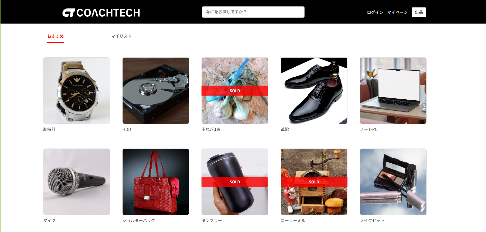 

## 作成した目的
webアプリケーション開発の学習のため

## アプリケーションURL
・開発(ローカル)環境<br />
http://localhost<br />
http://locaohost:8080<br />

## 機能一覧

### 一般ユーザーの機能
・会員登録/ログイン/ログアウト/マイページ/出品<br />
未ログイン時に画像のメニューロゴからログインフォームへ移動できる。<br />
ログインフォームに会員登録のリンクがあるのでそこから移動できます。<br />
ログイン時にはログアウトとマイページ、出品へのリンクへとアクセスできる。


・メール認証機能<br />
会員登録時に認証確認画面へと遷移し確認メールを送信します。<br />
MailHogを使用しているのでhttp://localhost:8025 でメールを確認、認証できます<br />
認証したユーザーはプロフィール作成画面へと遷移ます。<br />
作成したユーザーはマイページや商品購入ページへアクセス可能となる。<br />

・検索機能<br />
この検索フォームでは部分一致検索もできます。<br />


・おすすめタブとマイリストタブ<br />
自身の出品した商品以外がおすすめタブで表示されます。<br />
いいねした商品はマイリストタブでも表示されます。<br />


・商品詳細ページ<br />
このページでは以下の項目が確認できます。<br />
    -商品画像<br />
    -商品名<br />
    -値段<br />
    -いいね数(☆マーク)<br />
    -購入ページへ遷移<br />
    -商品説明<br />
    -商品の情報<br />
    -コメント閲覧<br />
    -コメント書き込み<br />
☆マークを押下することでマイリストに商品を登録できます。<br />
もう一度押すと解除されます。<br />

・商品購入ページ<br />
カード支払いかコンビニ支払いを選択でき、配送先はデフォルトでプロフィール作成時に設定した住所が表示されています。<br />
「変更する」を押すと住所変更ができます<br />
確認したら購入ボタンを押すとstripeの決済画面へ遷移します。(テスト環境なのでコンビニ決済を実際にはできません)<br />

・マイページ<br />
出品した商品と購入した商品をタブを切り替えて確認できます。<br />
カテゴリは複数選択可能です<br />

・出品機能<br />
出品ページでは画像、カテゴリ、商品の詳細情報、商品名と説明を記入して出品できます。<br />

・取引中の商品タブ<br />
ユーザーが商品を購入した段階で出品者と購入者のマイページの取引中の商品タブに商品が追加される。<br />
タブには取引中の商品の件数が表示され、標示されている商品の左上には新着メッセージの件数が表示される。<br />
商品画像をクリックすることで取引チャット画面へ遷移できる。
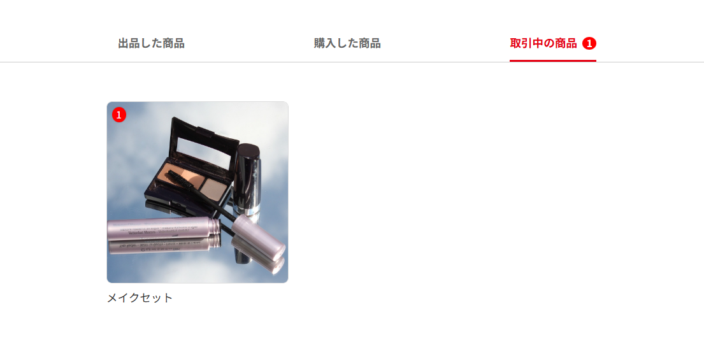 
<br />
・取引チャット機能<br />
購入者と出品者は「取引中の商品」タブの表示画像よりチャット画面へ遷移できる。<br />
サイドバーで現在進行している取引の商品についてのチャット画面へ遷移できる。取引中の商品の並び順は新規メッセージが来た順に表示すされる。<br />
その際、入力中のメッセージは保持される。<br />
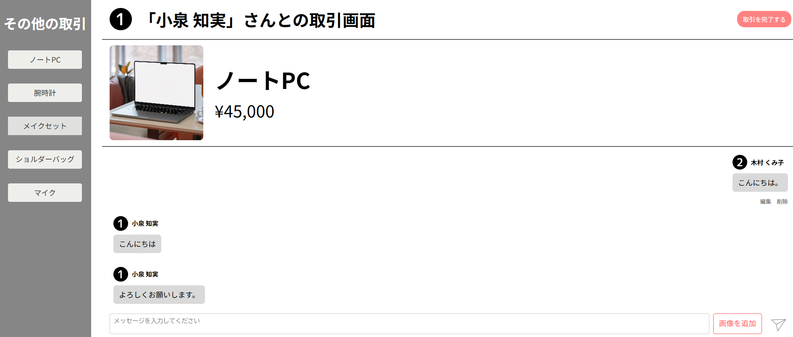 
<br />

投稿済みのメッセージのみを編集・削除することができる<br />
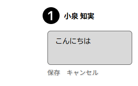 
<br />

・評価機能<br />
購入者のみ、取引を完了ボタンをクリックすると取引完了モーダルからユーザーの評価をすることができる<br />
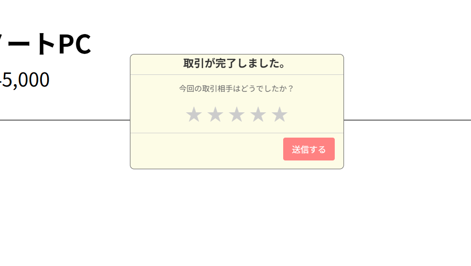 
<br />

購入者が評価を送信すると、出品者にメールで通知される。<br />
出品者はその後取引チャットにアクセスした際、モーダルが表示され評価することができる。<br />
モーダルを消してしまっても再度アクセスすると表示される。<br />
評価された平均値は四捨五入され、マイページで表示される。
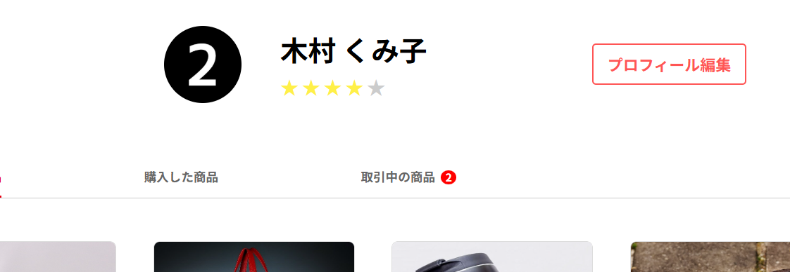 
<br />

## 使用技術（実行環境）
・開発フレームワーク<br />
  PHP 8.1.32  <br />
  Laravel: 10.48.28<br />
  Stripe<br />
  MySQL: 15.1 <br />
  Laravel Fortify<br />
  mailHog<br />
  ストレージ<br />


## テーブル設計
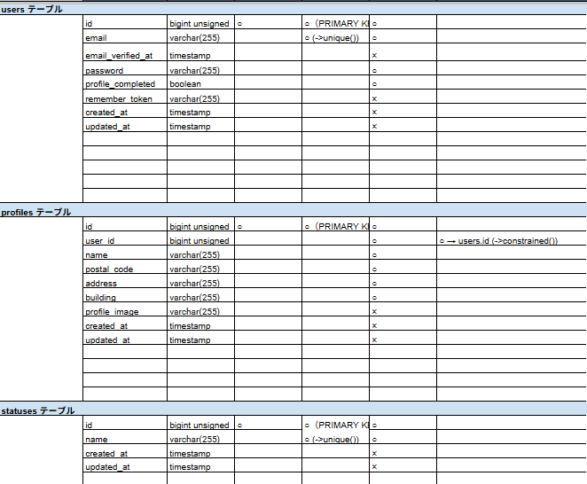 
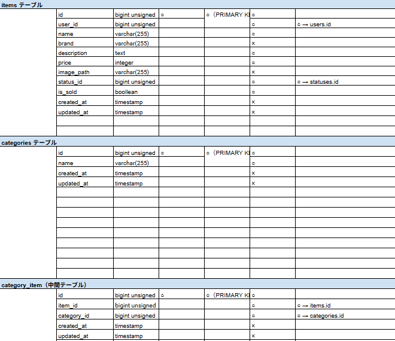 
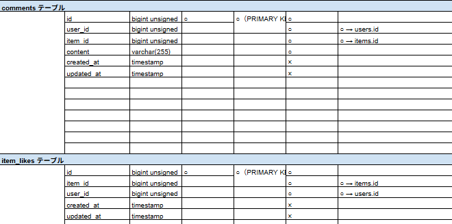 
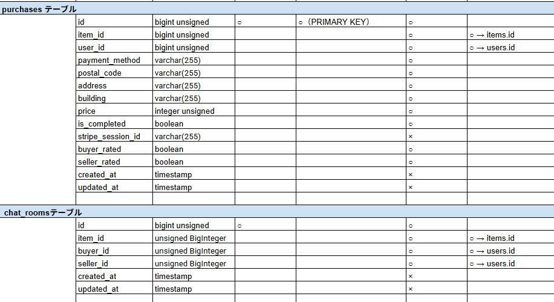 
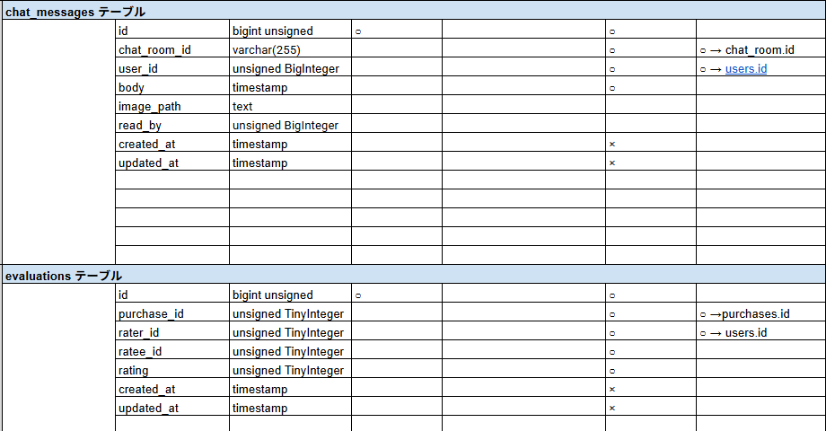 

## ER図
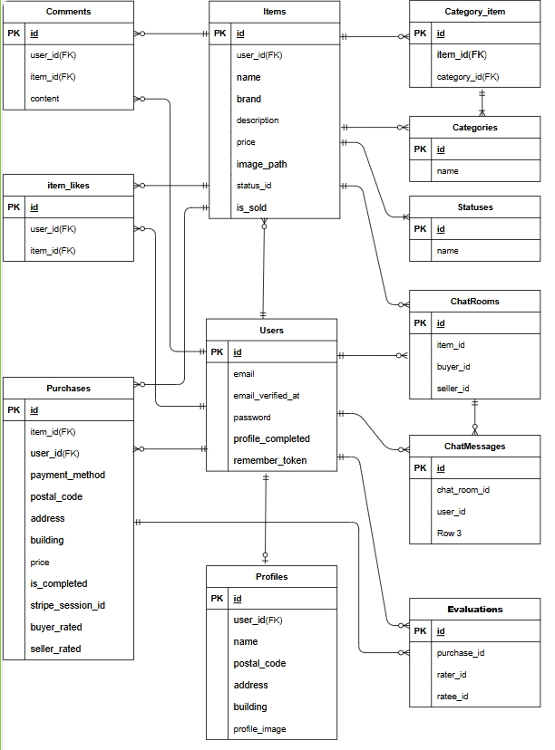 

## 環境構築
ローカル環境下においてのテスト環境構築手順を示します。
作業ディレクトリにgithubのリポジトリをcloneします。
```
git clone git@github.com:yasu2244/Flea-market.git
```
githubアカウントでログインし、リモートリポジトリを作成します。<br />
変更先のリポジトリの作成が終わったら、ローカルリポジトリから紐付け先を変更します。
作成したリポジトリからSSHの url を取得して、以下のコマンドを実行してください。
```
git remote set-url origin 作成したリポジトリのurl
```
次に、現在のローカルリポジトリのデータをリモートリポジトリに反映させます。
```
git add .
```
```
git commit -m "リモートリポジトリの変更"
```
```
git push origin main
```
dockerコンテナを起動する前にテストに使う下記のファイルを必ずコピーして作成してください。<br />
```
cp src/.env.testing.example src/.env.testing
cp src/.env.dusk.local.example src/.env.dusk.local
```
続いて、.env.exampleファイルをコピーして.envファイルを作成します。
```
cp src/.env.example src/.env
```
作成ができたら.envファイルを以下のように修正します。
```
APP_NAME=フリマアプリ
APP_ENV=local
APP_KEY=
APP_DEBUG=true
APP_URL=http://localhost

DB_CONNECTION=mysql
DB_HOST=mysql
DB_PORT=3306
DB_DATABASE=laravel_db
DB_USERNAME=laravel_user
DB_PASSWORD=laravel_pass

```

cloneしたFlea-marketの直下ディレクトリに移動してDockerを起動します。<br />
存在しない場合は、起動時にエラーになります。
```
docker-compose up -d --build
```
phpコンテナにログインします。
```
docker-compose exec php bash
```
composerをインストールします。
```
composer install
```

phpコンテナ内でアプリケーションの暗号キーの作成、テーブルとダミーデータの作成を行います。<br />
マイグレーションが正常に動かない場合はdockerコンテナを再起動してみてください。<br />
ユーザーのダミーデータの詳細ついては以下の通りです。<br />       
3つのダミーデータはすべてプロフィール作成とメール認証済みです。<br />      
 
No.1<br /> 
メールアドレス：test1@example.com <br />  
パスワード：1234test1 <br /> 
出品商品：腕時計/HDD/玉ねぎ3束/革靴/ノートPC <br /> 
<br /> 
No.2<br /> 
メールアドレス：test2@example.com   <br />  
パスワード：1234test2 <br /> 
出品商品：マイク/ショルダーバッグ/タンブラー/コーヒーミル/メイクセット <br /> 
<br /> 
No.3<br /> 
メールアドレス：test3@example.com   <br />  
パスワード：1234test3 <br /> 
出品商品：なし<br />       


```
php artisan key:generate
```
```
php artisan migrate
```
```
php artisan db:seed
```
次にメール機能を使用するため.envファイル31行目以降を修正、追加します。
```
MAIL_MAILER=smtp
MAIL_HOST=mailhog
MAIL_PORT=1025
MAIL_USERNAME=null
MAIL_PASSWORD=null
MAIL_ENCRYPTION=null
MAIL_FROM_ADDRESS=example@example.com
MAIL_FROM_NAME="Flea Market App"

FEATURES=emailVerification
```

以上を変更したらhttp://localhost:8025 へアクセスできれば成功です。<br />
ブラウザにPermission deniedというエラーが出たら下記のコマンドを試してください。
```
sudo chmod -R 777 src/*
```

次にストレージのシンボリックリンクを作成。画像が正常に表示されます。<br />
dockerコンテナ内で
```
php artisan storage:link
```

### Stripeの実装
まずStripeのアカウントを作成し、APIキーを取得する必要があります。<br />
#### 1. Stripeアカウントの作成
1. [Stripe公式サイト](https://dashboard.stripe.com/register) にアクセスし、新規アカウントを作成。
2. ダッシュボードにログイン。

#### 2. APIキーの取得
1. Stripeダッシュボードで「開発者」→「APIキー」に移動。
2. 公開可能キー（Publishable key）と シークレットキー（Secret key）を取得。
3. `.env` ファイル下部に以下のように追加してください。
```
STRIPE_KEY=your_stripe_public_key
STRIPE_SECRET=your_stripe_secret_key
```

#### 3. コンビニ支払いの有効化
1. Stripeダッシュボードの設定から「決済」→「決済手段」タブに移動。
2. 店舗支払い欄のコンビニ決済を有効にする。

以上で使用可能になります。<br />

### ダミーデータについて


## テスト方法
### 概要
このアプリケーションでは以下のテストを含んでいます。<br />
・Feature テスト（PHPUnit）<br />
支払い方法選択機能以外のテスト<br />
・Browser (Dusk) テスト<br />
支払い方法選択機能のテスト

### 必要環境
・PHP >= 8.1<br />
・Composer<br />
・Chrome または Chromium<br />
・ChromeDriver（Dusk を使用する際）cp .env.dusk.local.example
・MySQL 8.0 (ローカル開発用)<br />

### 環境ファイル準備
Dusk テスト用に.env.dusk.local、<br />
Featureテスト用に.env.testingの2つのファイルが必要なので<br />
存在していないのなら適宜、下記のコマンドでコピーして作成してください。<br />
※環境構築のdockerコンテナを起動する前に、.env.testinと.env.dusk.localは作成済み<br />
```
cp src/.env.testing.example src/.env.testing
cp src/.env.dusk.local.example src/.env.dusk.local
```

環境構築でも作成しましたが、作成していなければphpコンテナ内で下記のコマンドでテスト用APP_KEYが生成してください。<br />
.envの「APP_KEY=」に生成されたキーを.env.testingと.env.dusk.localの「APP_KEY=」に貼り付けてください。<br />
```
php artisan key:generate
```

#### テスト用データベースの作成
phpコンテナから「exit」で抜けてmysqlコンテナ内でテスト用データベースを作成します。
```
docker-compose exec mysql bash
mysql -u root -p
```
パスワードは、docker-compose.yml の MYSQL_ROOT_PASSWORD で指定した password を入力してください。<br />
下記のコマンドで作成できます。
```
CREATE DATABASE IF NOT EXISTS demo_test CHARACTER SET utf8mb4 COLLATE utf8mb4_unicode_ci;
```
権限の付与
```
GRANT ALL PRIVILEGES ON demo_test.* TO 'laravel_user'@'%';

FLUSH PRIVILEGES;
```

データベースの確認<br />
下記のコマンドを実行すると demo_test が一覧に含まれているはずです。
```
SHOW DATABASES;
exit
```
再びphpコンテナで設定キャッシュをクリア。
```
php artisan config:clear
php artisan cache:clear
```
コンテナを抜けてdockerコンテナを停止・削除し、そのあと再起動させる
```
docker-compose down
docker-compose up -d --build
```

### PHPUnit テスト
phpコンテナ内で行ってください。<br />
依存パッケージのインストール（初回のみ）
```
composer install
```
データベースマイグレーション・シーディング（初回またはテーブル構造が変わったとき）
```
php artisan migrate:fresh
```
・PHPUnit テストの実行
 全テスト
```
php artisan test
```
Feature テストのみ
```
php artisan test --filter=Feature
```
特定のテストクラスだけ
```
php artisan test --filter=MyListTest
```
### Laravel Dusk（ブラウザテスト）
phpコンテナ内で行ってください。<br />
Dusk ドライバのインストール（初回のみ）
```
composer require --dev laravel/dusk
php artisan dusk:install
```
.env.dusk.local を環境に合わせて編集
```
APP_URL=http://nginx

DB_DATABASE=demo_test
DB_USERNAME=laravel_user
DB_PASSWORD=laravel_pass
```
・Dusk テストの実行
全ブラウザテスト
```
php artisan dusk
```
支払い方法選択機能 Duskテストだけ
```
php artisan dusk --filter=PaymentMethodBrowserTest
```


